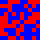
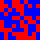
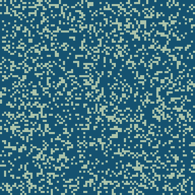
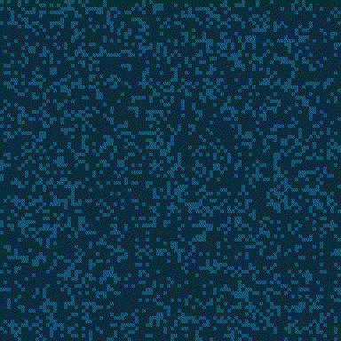
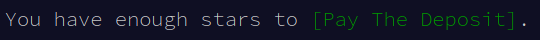

# Day 20: Jurassic Jigsaw

## Steps

1. Parse input
   + Separate frame from actual content
   + Include all permutations of the edges
1. Make neighbour mapping
   + `int -> [int]`
1. Find the four tiles that have 2 neighbours
   + Those are corners
   + **Part one done!**
1. Find ordering of tiles
   + `[[int]]`
1. Rotate and flip tiles to match order
1. Merge tiles into full image
1. Rotate until you find a sea monster
   + Flipping should not be necessary
1. Replace sea monster #'s in image
1. Count all #'s left in image
   + **That's part two!**

## Initial tests

Can I rotate an image?  
 ⟲  

## Visuals

Rotating and flipping, with borders:  
  
(compressed using a script from [this page](https://cassidy.codes/blog/2017/04/25/ffmpeg-frames-to-gif-optimization/), it was 70 MB before)

Merged to one image:  

Searching for sea monsters:  

## Then, finally...

