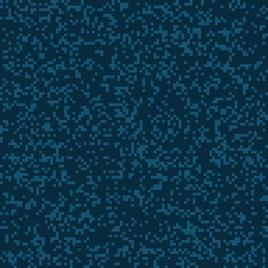

# Day 20: Jurassic Jigsaw

## Steps

#. Parse input
   + Separate frame from actual content
   + Include all permutations of the edges
#. Make neighbour mapping
   + `int -> [int]`
#. Find the four tiles that have 2 neighbours
   + Those are corners
   + **Part one done!**
#. Find ordering of tiles
   + `[[int]]`
#. Rotate and flip tiles to match order
#. Merge tiles into full image
#. Rotate until you find a sea monster
   + Flipping should not be necessary
#. Replace sea monster #'s in image
#. Count all #'s left in image
   + **That's part two!**

## Visuals

With borders and grid:  

Merged to one image:  

Sea monsters:  

## Then, finally...

